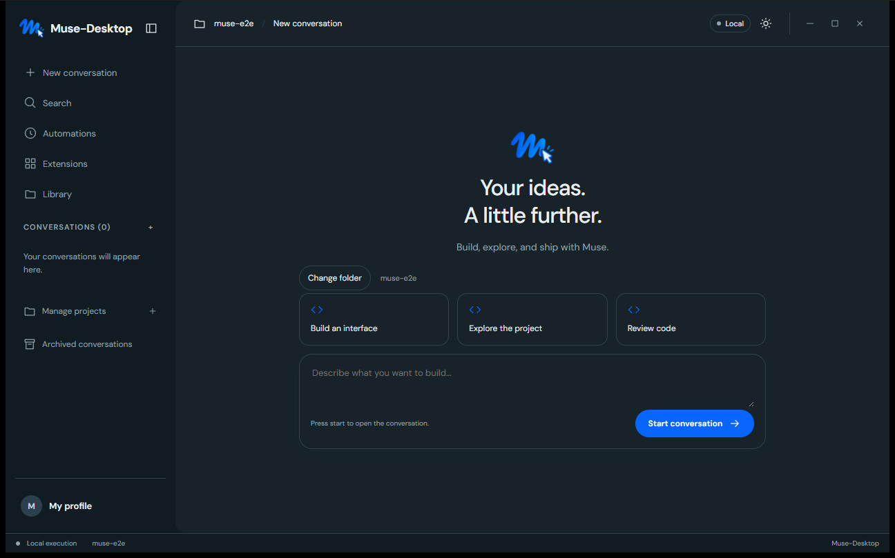

# Muse-Desktop

A desktop workspace for Muse Code, built with Tauri, React, and Vite.



Organize conversations by project, work with Muse, and review activity and generated content in a focused desktop interface.

The agent engine runs through the `muse` CLI sidecar. The current Windows build uses Muse installed in the default WSL distribution; WSL and Muse must already be configured. See the [Windows build instructions](scripts/wsl-bridge/README.md).

## Development

```sh
npm install
npm run dev
```

The browser preview displays the interface. Working with the engine requires the desktop app and a compatible sidecar:

```sh
npm run tauri -- dev
```

To build the Windows x64 installer locally (the matching `muse` sidecar must be present in `src-tauri/binaries/`):

```sh
npm run tauri -- build --bundles nsis
```

The NSIS installer is written to `src-tauri/target/release/bundle/nsis/`. Release signing, publishing and update channels are not configured yet.

On Windows, `powershell -ExecutionPolicy Bypass -File scripts/build-windows.ps1` performs the same build after checking that the x64 sidecar is present. Pass `-Bundle msi` or `-Bundle all` when another bundle format is needed.

Remote MCP endpoints can be tested from **Extensions** with a public HTTPS URL. Muse performs a real `initialize`/`tools/list` exchange (JSON or SSE) before saving the catalogue; bearer tokens remain in memory and must be entered again after a relaunch. OAuth and native secret-store integration are still planned.

## Documentation

- [Product and technical specification](docs/SPEC.md)
- [Implementation plan](docs/plans/2026-09-07-muse-desktop.md)
- [Operational roadmap and feature status](docs/ROADMAP.md)
- [Detailed implementation plan for coding agents](docs/plans/2026-09-15-agent-implementation-plan.md)
- [Codex parity audit](docs/plans/2026-09-15-codex-parity-audit.md)
- [Conversation UX refinements](docs/plans/2026-09-14-conversation-polish.md)

The screenshot shows the native Windows application. Some planning documents are currently in French.
